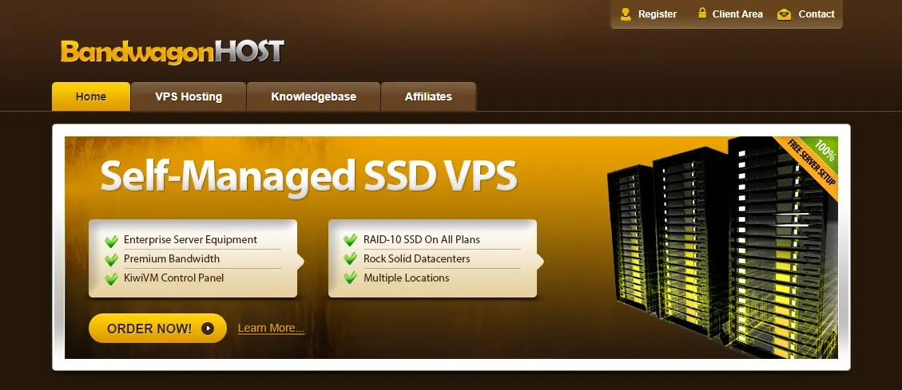
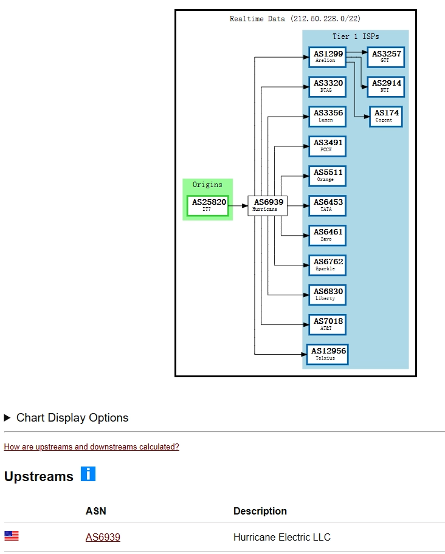
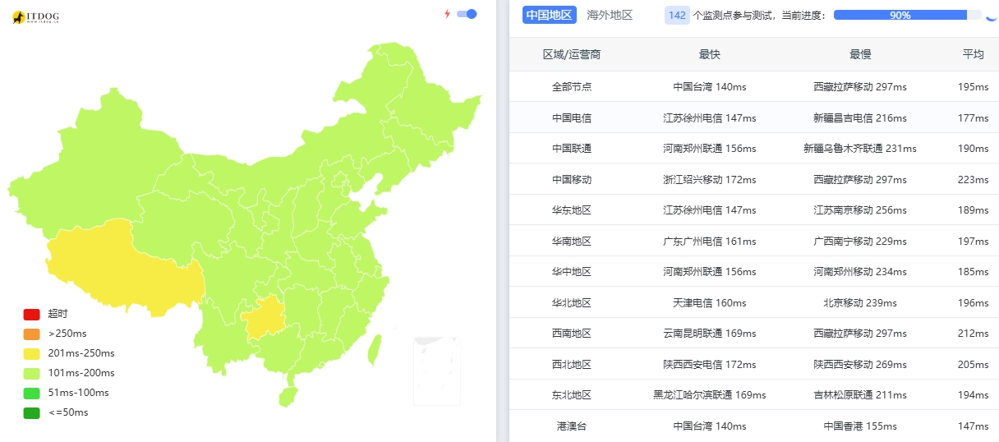
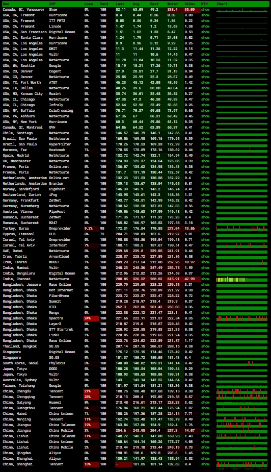

# 搬瓦工年付17美元VPS实测：1TB流量+解锁Netflix/TikTok/ChatGPT

---

想找一台便宜又能用的美国VPS？搬瓦工这款年付17美元的迷你鸡今天补货了，1TB月流量、1Gbps带宽，还能解锁Netflix、TikTok和ChatGPT。虽然没有CN2优化线路，但作为应急备用或轻量站点部署来说，这个价格配置算是相当划算了。

---

## 补货了！年付17刀的小鸡回来了

搬瓦工的MINICHICKEN-20-1024套餐今天又补货了。说实话，看到补货通知的时候我没忍住，直接下单了一台。

先看配置：
- **存储**：20GB SSD RAID-10
- **内存**：1GB
- **CPU**：1核 Intel Xeon
- **流量**：1TB/月
- **带宽**：1Gbps
- **价格**：年付19美元（用优惠码后17.71美元）



机房位置在美国加利福尼亚州弗里蒙特，带免费自动备份快照。线路方面，上游走的是HE（Hurricane Electric），没有针对中国大陆的优化，不过也不绕路。

如果你正在寻找稳定的美国VPS服务，想要更好的线路体验，👉 [搬瓦工提供多条针对中国优化的CN2 GIA线路，延迟更低、速度更快](https://bandwagonhost.com/aff.php?aff=79616)。



测试IP：`212.50.228.1`

## 基础性能：够用就行

跑了个常规测试，看看硬件配置：

```
CPU：Intel Xeon Processor (Cascadelake)
核心：1核心 @ 2599.998 MHz
内存：1GB（实际可用1035MB）
硬盘：21.4GB 总空间
系统：Debian GNU/Linux 12
虚拟化：KVM
组织：IT7 Networks Inc (AS25820)
位置：美国加利福尼亚州弗里蒙特
```

磁盘I/O测试了三次，平均速度在309.3 MB/s左右，对于这个价位来说还算不错。

## 流媒体解锁：意外的惊喜

这个是我比较关心的部分。测试结果显示：

**IPv4解锁情况：**
- ✅ TikTok：原生解锁（美国区）
- ✅ Netflix：原生解锁（美国区）
- ✅ YouTube Premium：原生解锁
- ✅ Amazon Prime Video：原生解锁（美国区）
- ✅ TVBAnywhere+：原生解锁
- ✅ iQyi海外版：原生解锁（美国区）
- ✅ ChatGPT：DNS解锁（美国区）
- ✅ Google Gemini：原生解锁（美国区）
- ❌ Disney+：不支持
- ❌ Spotify：不支持注册

**IPv6解锁情况：**
- ✅ TikTok：原生解锁（美国区）
- ✅ Disney+：原生解锁（美国区）
- ✅ Netflix：原生解锁（美国区）
- ✅ YouTube Premium：原生解锁
- ✅ Google Gemini：原生解锁（美国区）

对于年付17美元的VPS来说，这个解锁能力已经超出预期了。看Netflix美区内容、刷TikTok、用ChatGPT都没问题。

## 延迟和丢包：符合预期

### 国内延迟情况



因为没有CN2优化，延迟肯定不会特别理想。从测试结果看，大部分地区延迟在150-200ms之间，晚高峰可能会更高一些。



丢包率方面，测试时段基本没有丢包，这点还挺稳定的。

## 速度测试：带宽跑得满

全球各节点测速结果：

```
洛杉矶节点：上传2049 Mbps / 下载2148 Mbps / 延迟9.51ms
上海联通：上传1483 Mbps / 下载2902 Mbps / 延迟182.81ms
杭州电信：上传138 Mbps / 下载2423 Mbps / 延迟150.33ms
香港节点：上传274 Mbps / 下载6053 Mbps / 延迟150.74ms
新加坡节点：上传364 Mbps / 下载1503 Mbps / 延迟185.18ms
伦敦节点：上传620 Mbps / 下载1071 Mbps / 延迟142.81ms
```

本地测速（Speedtest.net）跑出了8.4Gbps的下载速度，带宽是真的给力。国内方向的速度受线路影响会打折扣，不过日常使用还是够的。

## 路由追踪：HE线路直连

回程路由走的都是HE（Hurricane Electric）的线路。

**电信方向：**
弗里蒙特 → HE圣何塞 → 电信圣何塞入口 → 上海

**联通方向：**
弗里蒙特 → HE圣何塞 → 联通上海 → 目标城市

**移动方向：**
弗里蒙特 → HE圣何塞 → CMI圣何塞 → 移动骨干网

总体来说，路由比较干净，不绕路，但也没有特别的优化。

### IPv6路由

IPv6的路由情况各地差异比较大，有兴趣的可以自己测测。从我的测试看，电信和联通的IPv6路由还算正常，移动会绕道西雅图。

## 值得买吗？

17美元一年，平均每个月1.4美元。对于这个价格，我觉得性价比还是挺高的：

**适合用来：**
- 搭建轻量级个人博客或网站
- 做代理节点应急备用
- 测试和学习Linux系统
- 挂机运行小脚本

**不太适合：**
- 需要低延迟的游戏加速
- 大流量下载或PT
- 对国内访问速度要求高的业务

特别要说的是，这个套餐还带免费自动备份快照，对于数据安全来说是个加分项。虽然没有大陆优化线路，但特殊时期拿来应应急还是没问题的。

---

## 总结

搬瓦工这款年付17美元的VPS，配置够用、价格便宜、流媒体解锁能力还不错。如果你只是需要一台稳定的美国VPS，不太在意延迟，那这款小鸡确实值得考虑。毕竟一年才17美元，试错成本也不高，而且还有30天退款保证。

想要更专业的服务体验？👉 [搬瓦工还提供多种高端线路套餐，CN2 GIA直连中国，延迟低至80ms，适合对网络质量有更高要求的用户](https://bandwagonhost.com/aff.php?aff=79616)。补货不常有，需要的话可以先下单，反正不满意还能退。
